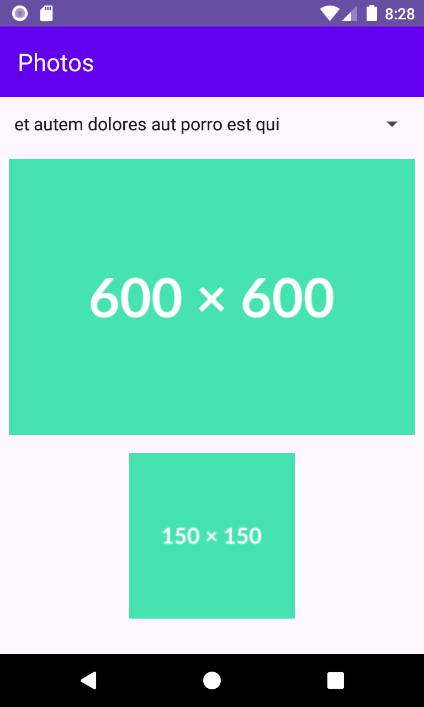

## 📷 Screenshots

# Photos

Aplicativo Android desenvolvido em Kotlin que consome o Web Service JSONPlaceholder utilizando a biblioteca Volley.
Projeto desenvolvido para disciplina de Desenvolvimento de Android 2 do curso de especialização IFSP SDM São Carlos.

## 📌 Objetivo

O aplicativo busca a lista de fotos do endpoint:

https://jsonplaceholder.typicode.com/photos

Exibe os títulos em um Spinner.  
Ao selecionar um título, são exibidas:

- A imagem principal (url)
- A imagem thumbnail (thumbnailUrl)

## 🛠 Tecnologias Utilizadas

- Kotlin
- Android Studio
- Volley (requisições HTTP)
- Glide (carregamento de imagens)
- JSONPlaceholder (API pública)

## 📱 Funcionalidades

- Consumo de Web Service REST
- Conversão manual de JSON para objeto Kotlin
- Exibição dinâmica de dados
- Carregamento de imagens via URL

## 👩‍💻 Estrutura Base

Projeto desenvolvido com base no projeto DummyProducts, adaptado para o recurso /photos.
